# Memory Game - Portfolio project 2 - JavaScript

Memory Game is an interactive online home page where the use can play a simple card memory game, three levels with 20 tries to find all pairs.

You can access the site here: <a href="https://bo-lennart.github.io/memory_game/" target="_blank">Memory Game Page</a>

# Contents

- [Project Goals](#project-goals)
- [UX User Experience](#ux-user-eperience)
    - [Site Aims](#site-aims)
    - [User Stories](#user-stories)
    - [Color Scheme](#color-scheme)
- [Features](#features)
    - [Landing Page](#landing-page)
    - [Game Page](#game-page)
    - [Difficulty Levels](#difficulty-levels)
    - [Game Over](#game-over)
- [Technologies Used](#technologies-used)
- [Testing](#testing)
    - [Code Validation](#code-validation)
        - [w3c Valiadion](#w3c-validation)
        - [JSHint Validation](#jshint-validation)
        - [Lighthouse Testing](#lighthouse-testing)
        - [Manual Testing](#manual-testing)
- [Bugs](#bugs)
    - [turnCard() not working](#turncard-not-working)
    - [incrementAttempts() showing 'NaN'](#incrementattempts-showing-nan)
    - [Hide content of home screen not working](#hide-content-of-home-screen-not-working)
    - [body.appendChild to create New Game button not working](#bodyappendchild-to-create-new-game-button-not-working)
    -[Minor bugs](#minor-bugs)
        - [Mentor Feedback](#mentor-feedback)
- [Credits](#credits)
    - [Content](#content)
    - [Media](#media)
- [Deployment](#deployment)
    - [Deploy to GitHub Pages](#deploy-to-github-pages)
    - [To Fork the Repository](#to-fork-the-repository)
    - [To create a Local Clone](#to-create-a-local-clone)

# Project Goals

The aim of this project is to deliver an interactive game that is pleasing visually and functional for the user to play a memory game.

# UX User Experience 

## Site Aims
* To provide a simple interactive memory game with three levels of difficulty.
* To create a system that challenges the use to replay and have a goal to clear all three difficulty levels.
* To provide full responsive design in order to be able to play the game from different devices, such as, mobile phone, tablets or desktop screens.
* To provide an easy, understandable interactive experience for the use to navigate through the game.
* To provide a challenging game that is enjoyable but still challengning so the use can return to try the different levels.

## User Stories

The **user** is any person who likes simple, digital games.

| ID | ROLE | ACTION | |
|-----------------|:-------------|:---------------:|:---------------:|
| 1 | User | As a user, I want to be able to play memory | So I can have some fun|
| 2 | User | As a user, I want to be able to play the game across different devices | So I can access to game on the go and at home |
| 3 | User | As a user, I want the option of increased difficulty | So it's fun yet challenging |
| 4 | User | As a user, I want to be able to start the game when I am ready | So I can mentally prepare for the challenge |
| 5 | User | As a user, I want to be able to know how many cards I have found | So I know how much is left for me to find |
| 6 | User | As a user, I want to be able to start a new game when the current one ends | So I can try the challenge again or go to the next level |
| 7 | User | As a user, I want the game to end when I have to little tries left to win the level | So I don't have to spend time on a doomed try |

## Color Scheme

The color palette is inspired of a playfulness in order to match the pixel figures that are placed on the background. The theme of the memory game is "pixels" and therefore all the cards have a pixel-figure styled layout.

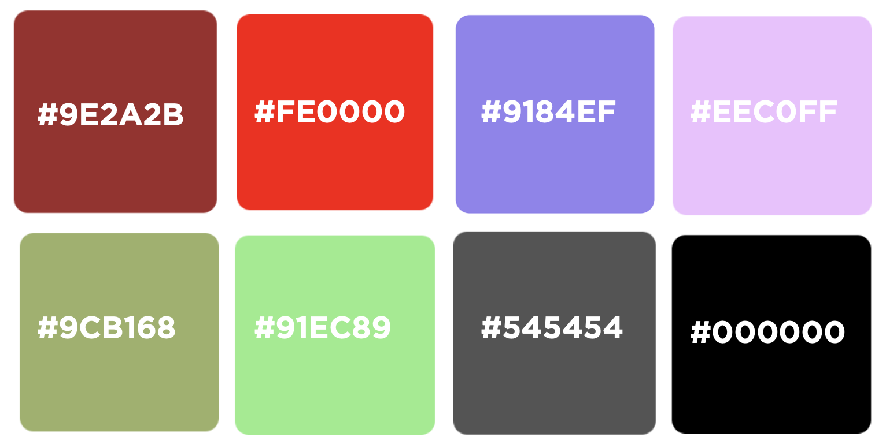

# Features

## Landing Page

1. At the top of the page the user finds a score count of how many cards they've found as well as how many attempts they've had.

2. Below the score counts a small box is presented with a few rules, followed by a heading that asks the user to choos a deck in order to start the game.

3. On each deck, the user finds a level combined with the colors: green, orange and red to present the difficulty levels. 

4. The landing page finishes off with a short text about what potential cognitive benefits it could have to play memory followed by the footer with social links.

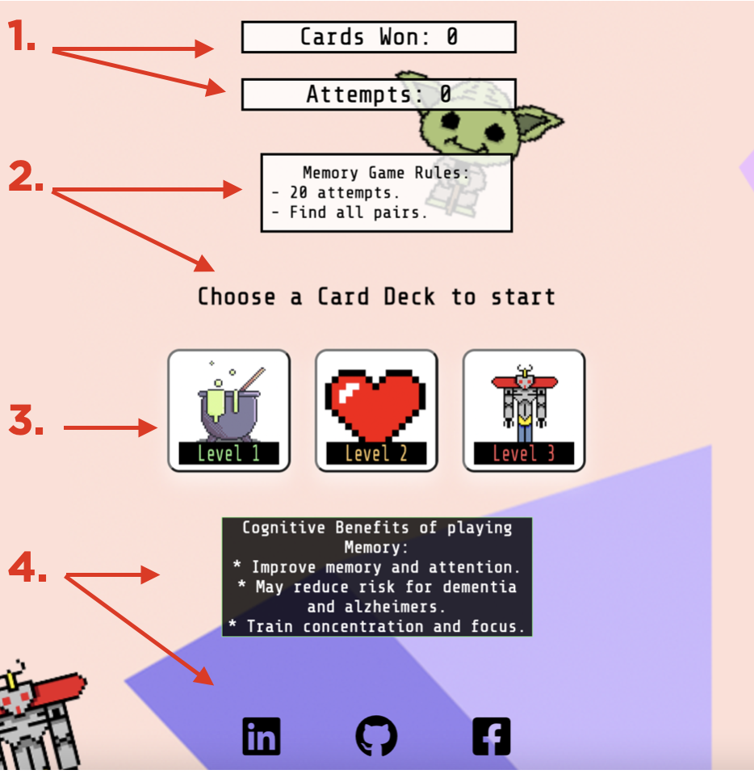

## Game Page

Each difficulty level is based on the same functionality. 
In the background of the page there are functions that count the attempts, how many cards founds, checks for matches, turn cards, display the correct images and checks if the game is to be interupted with game over or a win. A time out inside the turnCard-/2/3 function is added for the user so that they get a chance to memorise what cards they have turned.

## Difficulty Levels

The difficulty increases in terms of the amount of cards as well as the type of cards displayed. All decks have 20 tries to win.
1. Brew Deck: 16 cards with only pixel pictures.
2. Heart Deck: 20 cards with pixel pictures and alphabetical letters.
3. Robot Deck: 24 cards with only letters in black. 

| Pixel Deck | Amount of Cards | Failed Attempts Allowed | lvl |
|-----------------|:-------------|:---------------:|:---------------:|
| Brew | 16 | 12 | lvl 1 |
| Heart | 20 | 10 | lvl 2 |
| Robot | 24 | 8 | lvl 3 |

## Game Over

When the game is finnished the user is directed to the game over screen. Depending on if the user wins or loses the screen will either display a green box with 'You won' text or a red box with 'You lost' text. 

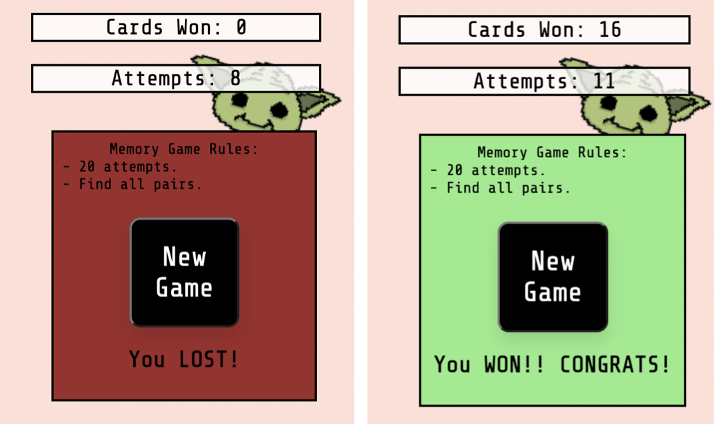

# Technologies Used

* HTML5 - Site structure and content
* CSS3 - Styling
* JavaScript - Site functionality, styling and logic.
* Adobe Photoshop - Edit images and backgrounds
* Gitpod
* GitHub
* Google Chrome DevTools - Used to debug, testing and try out css styling for screen responsiveness

# Testing

## Code Validation

### w3c Validation
This memory game has been tested through W3C HTML and W3C CSS validator. Minor errors where spotted and immediately corrected. These are documented below in [Bugs](#bugs)

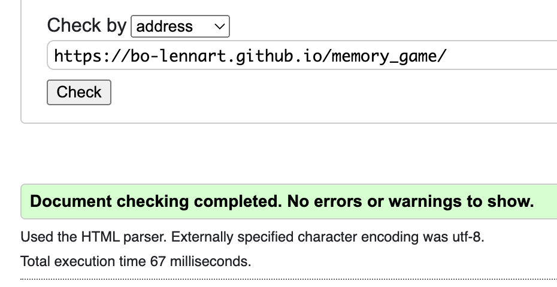

### JSHint Validation
The Javascript file was validated with JSHint. There were warnings such as: couple of undefined varibles, missing semicolons and that bodies of 'for ins' should be wrappet inside if-statements. These have been taken care of and JSHint has come up clean.

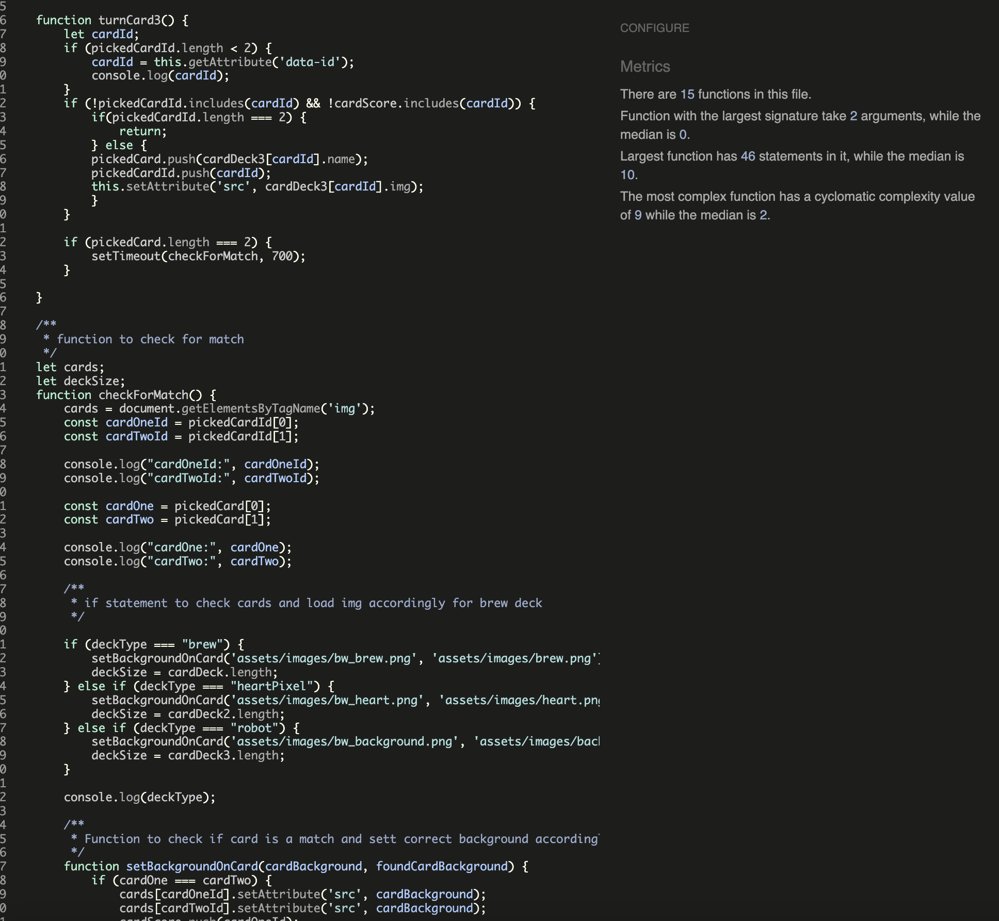

### Lighthouse Testing

Furthermore testing has been carried out on Performance, Accessibility, Best Practices and SEO via Lighthouse testing in Chrome DevTools. Both mobile and desktop performaces were tested.

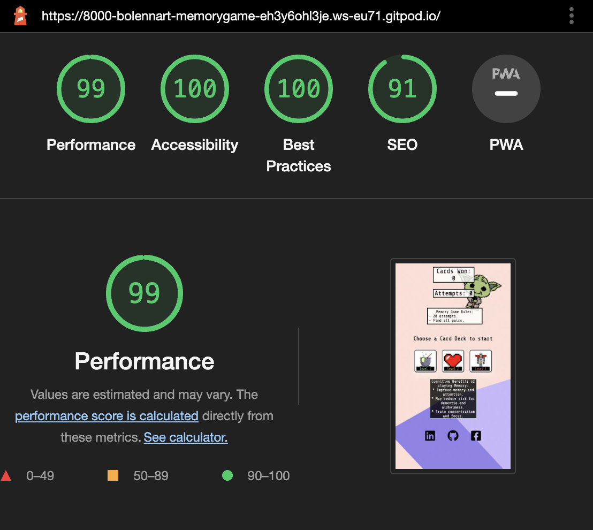
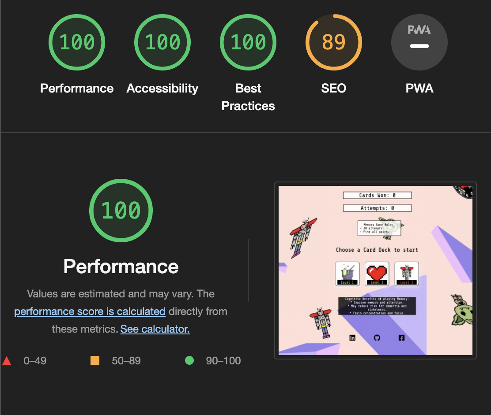

### Manual Testing

In addition to the automated testing services above, manual testing included:

* Firefox
* Safari
* Chrome

Multiple Devices with devtools:

* Iphone 13 pro
* Ipad pro
* Samsung galaxy s22
* Macbook pro

Game Screen testings:

* Home Screen
    * Social Links work
    * All card decks work on click and load the correct decks
    * Social links in footer work and open in new tab
* Game Screen
    * All card turn correctly, wait for the time out and check for match as well as loading the correct background img again
    * Social links in footer work and open in new tab
    * During this testing an error occured when unusual clicking behavior was tried. This error was fixed by setting a return/break inside the function that tries to load the card name to check the match.
    * 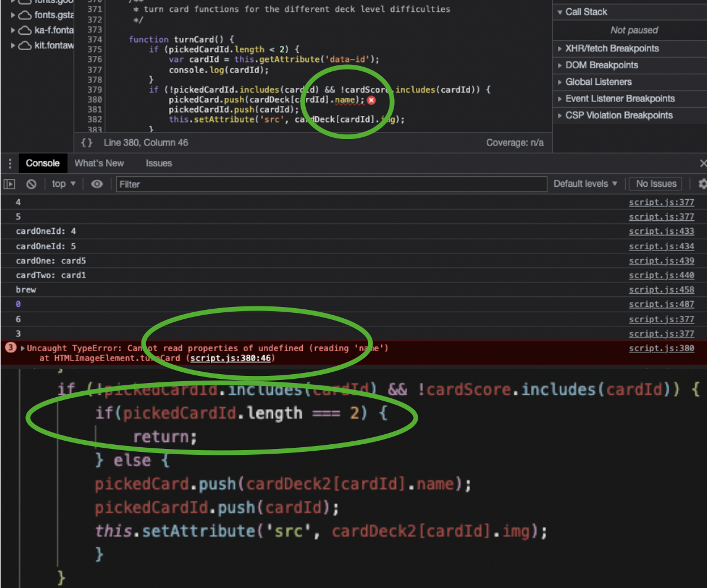

* Game Over Screen
    * Color inside rule box loads correctly depending on if the use wins or loses with the right text
    * New Game button works as intended and refreshes the page in order to restart the game
    * Social links in footer work and open in new tab

# Bugs

## turnCard() not working
During early stages of building the turnCard function the image that loaded after finding a match were correct. However it didn't work to turn new cards from there. This was due to the card array that is being pushed with the amounts of cards found, but didn't reset so the condition of 'pickedCardId.length < 2' was true and therefore the else condition could not load.
Error was fixed by resetting the value to an empty array inside the function that sets the pickedCardId value when 2 matches were found. 
* 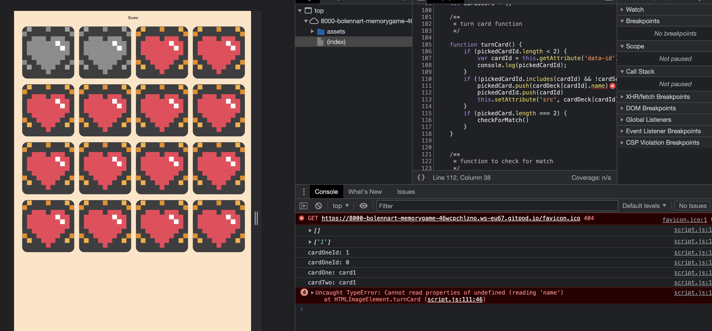

## incrementAttempts() showing 'NaN'
The incrementAttempts function showed NaN. This was fixed by using the parseInt in order to convert the taken innerHTML from the targeted element to a number.
* 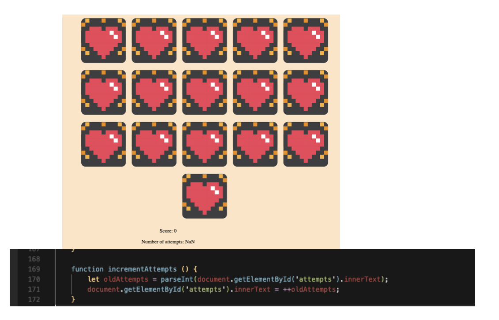

## Hide content of home screen not working

Due to a misspelling of the HTML id "gameBody" the styling request of 'none' could not load when deck choice had been made. 
* 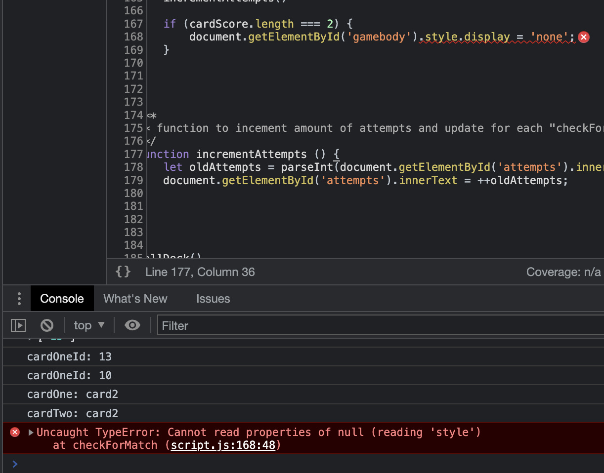

## body.appendChild to create New Game button not working

During the build of the New Game button that is created when the game is finnished the 'getElementsByTagName' did not work and could not target the body.

After a few minutes of google searching I found that someone had inserted an 'id' into the body to fix this issue.

This worked and by setting an id to the body the appendChild could create the NewGame button. 
* 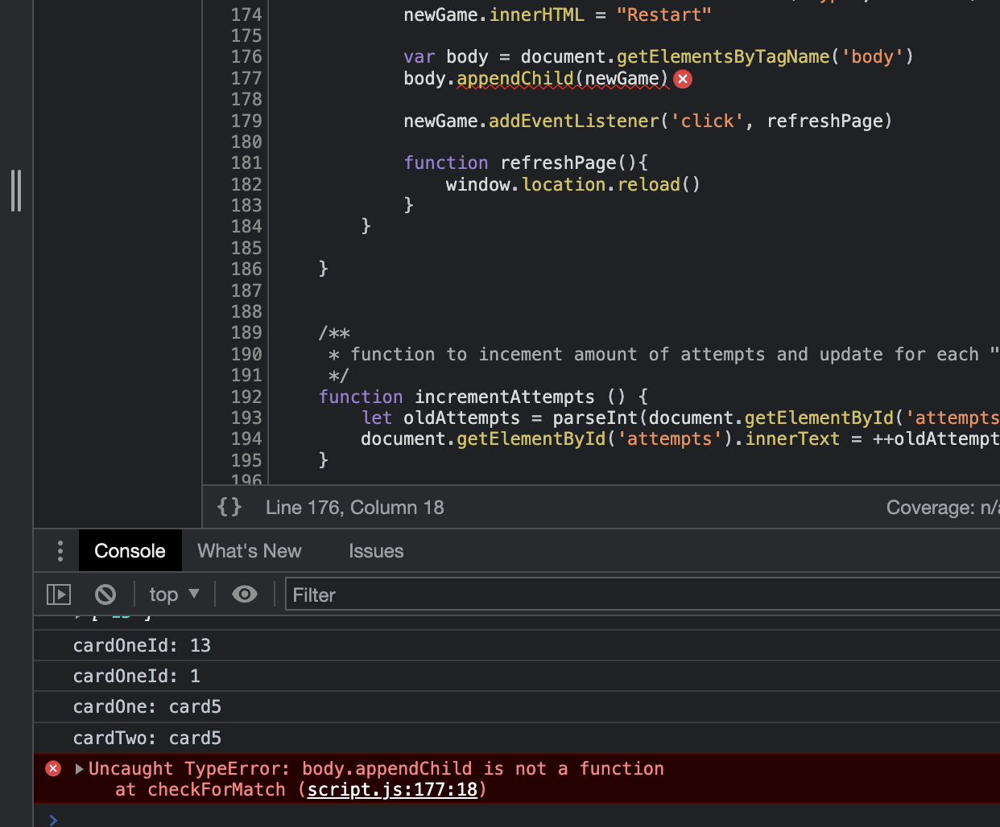

## Minor bugs

Apart from the above examples, other bugs occured during building the game. A couple of minor bugs within the same "type as mention above" such as misspelling, variables declared inside functions (and therefore could not be accessed globally) cause a lot of bugs here and there.

### Mentor Feedback

I had used a lot 'var' declarations druing building functions in order to access variable inside functions from outside the scopes. My mentor informed me about that this is not how 'var' was intended and that this type of declaration belongs to "older type of coding".  e recomended me to change these to 'let' and 'const' declerations and work my way around using 'var' at all.

A lot of work went into applying this feedback since the whole logic of the game was built with the starting point of using 'var' inside functions. But eventually I found my way around this an managed to declare variables outside functions and apply the intended logic without 'var' declerations.

# Credits

## Content

* <a href="https://www.youtube.com/watch?v=-tlb4tv4mC4&t=161s" target="_blank">Inspiration for Memory Game logic in JS</a>

* <a href="https://stackoverflow.com/questions/51037845/javascript-create-element-with-array" target="_blank">Creating element with array</a>
* <a href="https://github.com/Bo-Lennart/love-maths/blob/main/assets/js/script.js" target="_blank">Inspiration for incrementAttempts() function</a>
* <a href="https://bobbyhadz.com/blog/javascript-create-element-with-style-attribute" target="_blank">How to add styling through JavaScript</a>
* <a href="https://www.w3schools.com/howto/howto_js_add_class.asp" target="_blank">Add class element through JavaScript</a>
* <a href="https://developer.mozilla.org/en-US/docs/Web/CSS/box-shadow" target="_blank">Box Shadow in css</a>
* <a href="https://github.com/Bo-Lennart/dinder/blob/main/index.html" target="_blank">Footer with social media links and styling from my previous portfolio project (Dinder)</a>
* <a href="https://www.geeksforgeeks.org/how-to-change-an-input-button-image-using-css/" target="_blank">Insert images as background on buttons</a>
* <a href="https://www.delftstack.com/howto/css/css-font-border/" target="_blank">Text border</a>
* <a href="https://stackoverflow.com/questions/4851657/call-break-in-nested-if-statements" target="_blank">Bug/console error fix when checking for a match</a>
        * 

## Media

* <a href="https://pixabay.com/sv/illustrations/kamera-fickkamera-lins-fotografi-7279306/" target="_blank">Pixel Camera Image</a>
* <a href="https://pixabay.com/sv/illustrations/soppa-matr%c3%a4tt-mat-sk%c3%a5l-borscht-7238060/" target="_blank">Pixel Soup Image</a>
* <a href="https://pixabay.com/sv/illustrations/utomjordisk-fr%c3%a4mmande-liv-7440109/" target="_blank">Pixel Yoda Image</a>
* <a href="https://pixabay.com/sv/illustrations/emoji-ansikte-h%c3%a4ftigt-solglas%c3%b6gon-7277841/" target="_blank">Pixel Smiley Image</a>
* <a href="https://pixabay.com/sv/illustrations/regn-liten-droppe-natur-vatten-7236051/
" target="_blank">Pixel Water Drop Image</a>
* <a href="https://pixabay.com/sv/illustrations/v%c3%a4ckarklocka-klocka-8-bitars-pixel-7248174/" target="_blank">Pixel Alarm Clock Image</a>
* <a href="https://pixabay.com/sv/illustrations/hastighet-hastighetsm%c3%a4tare-bil-7309042/
" target="_blank">Pixel Timer Image</a>
* <a href="https://pixabay.com/sv/illustrations/brev-papper-post-e-post-ikon-7289597/" target="_blank">Pixel Envelope Image</a>
* <a href="https://pixabay.com/sv/illustrations/h%c3%a4xsk%c3%a5l-halloween-pixelkonst-pixel-6194394/" target="_blank">Pixel Brew Image</a>
* <a href="https://pixabay.com/sv/illustrations/video-game-8-bitar-gamla-skolan-175621/" target="_blank">Pixel Robot Image</a>
* <a href="https://pixabay.com/sv/illustrations/pixel-hj%c3%a4rta-hj%c3%a4rta-pixel-symbol-2779422/" target="_blank">Pixel Heart Image</a>

