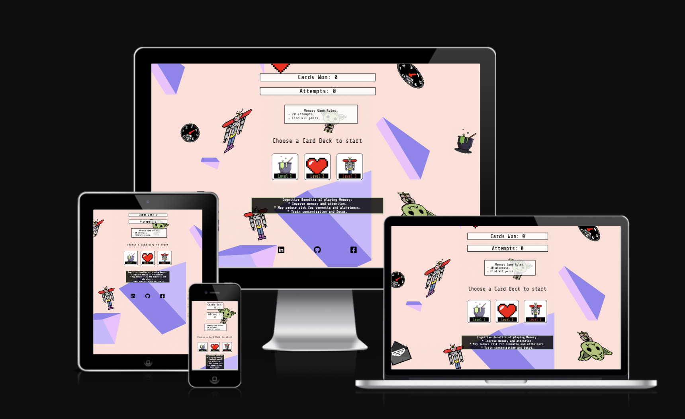

# Memory Game - Portfolio project 2 - JavaScript

Memory Game is an interactive online home page where the use can play a simple, 16 card memory game with 20 tries before game over. 

You can access the site here: <a href="https://bo-lennart.github.io/memory_game/" target="_blank">Memory Game Page</a>

# Contents

- [Project Goals](#project-goals)
- [UX User Experience](#ux-user-eperience)
    - [User Stories](#user-stories)
    - [Color Scheme](#color-schemes)
- [Features](#features)

- [Testing](#footer)
    - [Bugs](#bugs)
    - [Validator Testing](#validator-testing)
- [Deployment](#deployment)
    - [Deploy to GitHub Pages](#deploy-to-github-pages)
    - [To Fork the Repository](#to-fork-the-repository)
    - [To create a Local Clone](#to-create-a-local-clone)
- [Credits](#credits)
    - [Content](#content)
    - [Media](#media)

    # Project Goals

The aim of this project is to deliver an interactive game that is pleasing visually and functional for the user to play a memory game.

# UX User Experience 

